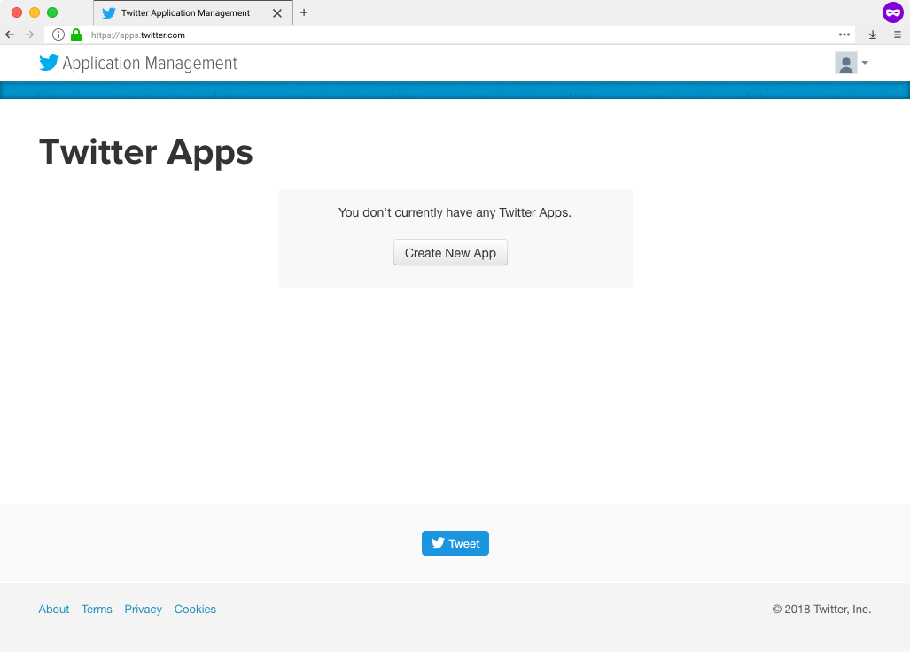
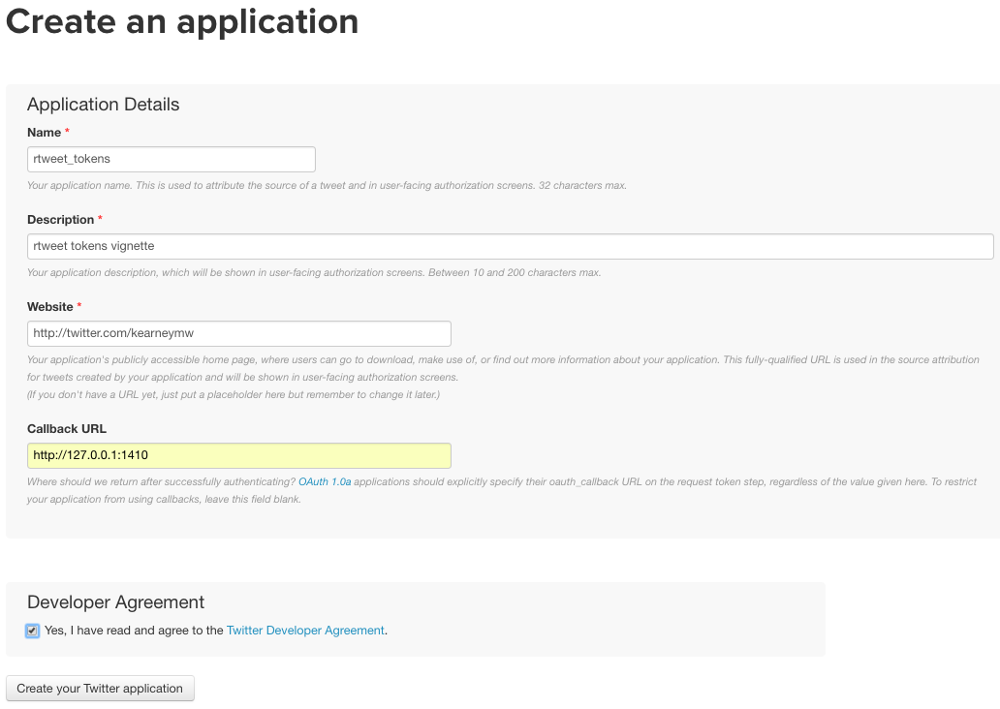
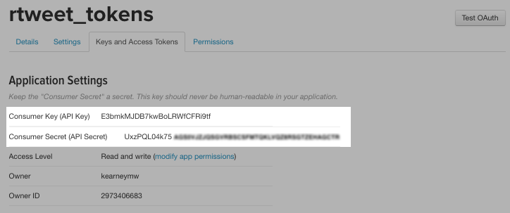

class: inverse, center, middle

# Creating a Twitter App

---

# Create a Twitter App

<span>1.</span> Log in to your [Twitter.com](https://twitter.com) account

<span>2.</span> Go to [apps.twitter.com](https://apps.twitter.com/) and select **Create New App**

<span style="margin-left:15%"></span>

---

<span>3.</span> Complete the fields (**important**: Callback URL must be exact)
  - Name: `{{initials}}_twitter_app`
  - Description: `{{something about analyzing Twitter data}}`
  - Website: `https://twitter.com/{{you_screen_name}}`
  - **Callback URL:** `http://127.0.0.1:1410`

<span style="margin-left:15%"></span>

<span>4.</span> Store name of app as `app_name` in R script

```{r}
## name of twitter app
app_name <- "mwk_twitter_app"
```

---

# Copy the keys

<span>5.</span> Click **Create your Twitter application**

<span>6.</span> Select **Keys and Access Tokens** tab

<span>7.</span> Copy the **Consumer Key (API Key)** and **Consumer Secret (API Secret)** and paste into R script

<span style="margin-left:15%"></span>

```{r}
## copy and pasted *your* keys (these are fake)
consumer_key <- "XYznzPFOFZR2a39FwWKN1Jp41"
consumer_secret <- "CtkGEWmSevZqJuKl6HHrBxbCybxI1xGLqrD5ynPd9jG0SoHZbD"
```

---

# Create a token

<span>8.</span> Pass the stored values to `create_token()` to create the Twitter authorization token.

```{r}
## create token
token <- create_token(app_name, consumer_key, consumer_secret)

## print token
token
```


---

# Storing Your Token

Every request sent to Twitter must include a token. Save yourself trouble by storing it as an environment variable.

```{r}
## save token to home directory
path_to_token <- file.path(path.expand("~"), ".twitter_token.rds")
saveRDS(token, path_to_token)

## create env variable TWITTER_PAT (with path to saved token)
env_var <- paste0("TWITTER_PAT=", path_to_token)

## save as .Renviron file (or append if the file already exists)
cat(env_var, file = file.path(path.expand("~"), ".Renviron"),
  fill = TRUE, append = TRUE)
```

Normally `.Renviron` is processed on start-up, so refresh it.

```{r}
## refresh .Renviron variables
readRenviron("~/.Renviron")
```
