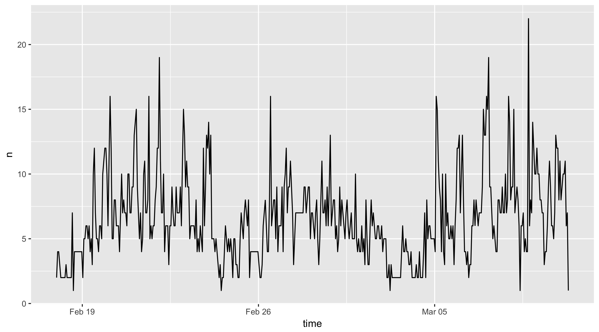
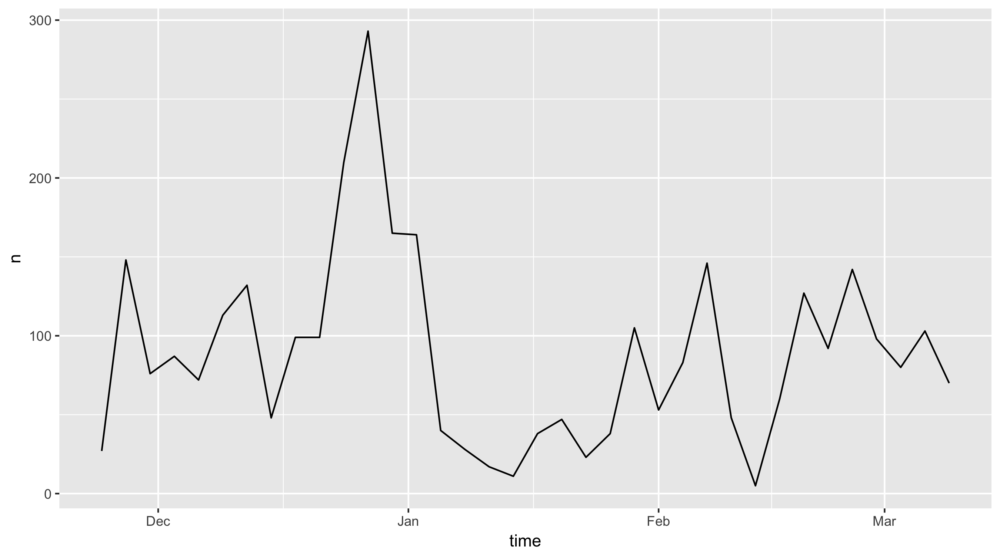
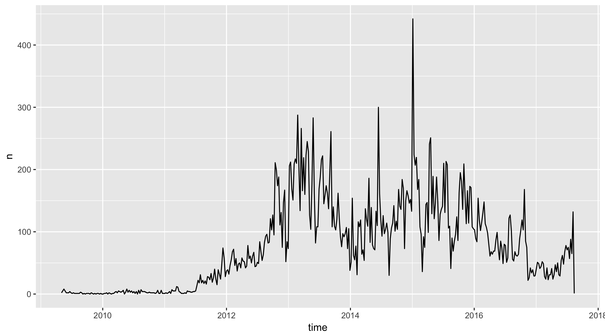
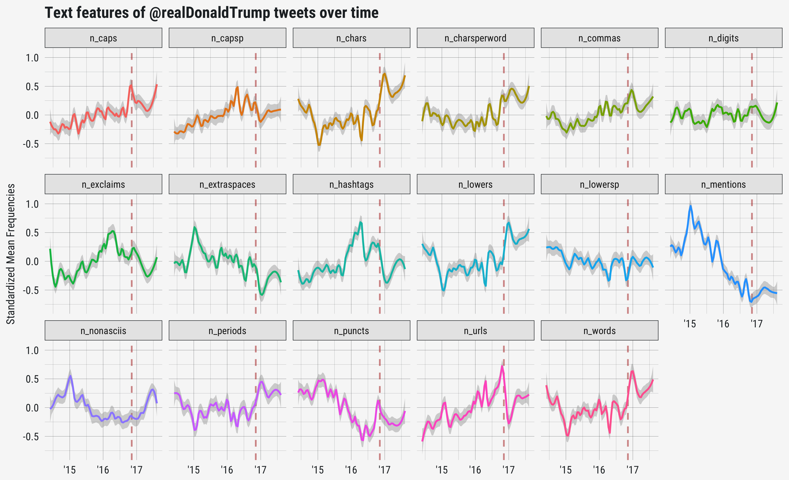
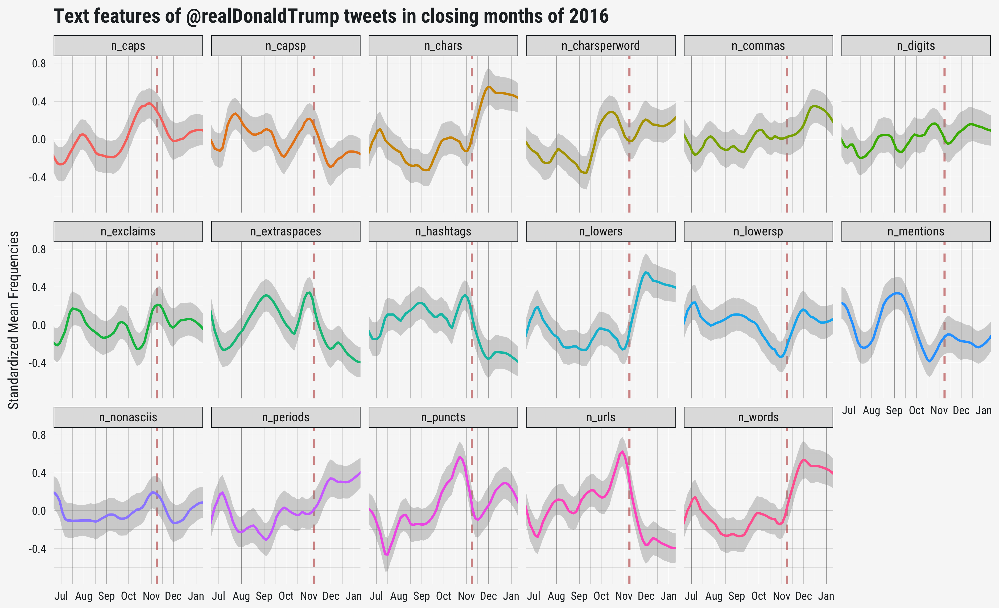

```{r setup, include=FALSE}
knitr::opts_chunk$set(echo = TRUE, eval = FALSE, collapse = TRUE, comment = ">")
options(htmltools.dir.version = FALSE)
htmltools::tagList(rmarkdown::html_dependency_font_awesome())
library(tidyverse)
library(rtweet)
head <- function(x, n = 6) {
  x[sapply(x, is.numeric)] <- lapply(x[sapply(x, is.numeric)], round, 2)
  x <- utils::head(x, n)
  knitr::kable(x, format = "html")
}
```

background-size: 150px auto
background-position: 490px 185px, 567px 320px, 644px 185px, 721px 320px, 644px 455px, 567px 50px
background-image: url(img/chr-logo.png), url(img/hexagon-logo.png), url(img/textfeatures-logo.png), url(img/tfse-logo.png), url(img/botrnot-logo.png), url(img/rtweet-logo.svg)

# About Me

**Academic nackground**

- PhD in COMS from Kansas

**Research interests**

- Partisan selective exposure
- Digital and social media

**\#rstats packages**

- Twitter APIs: [**{rtweet}**](https://cran.r-project.org/package=rtweet)
- Text analysis: [**{textfeatures}**](https://cran.r-project.org/package=textfeatures) [**{chr}**](https://github.com/mkearney/chr/)
- Data wrangling/viz: [**{hexagon}**](https://github.com/mkearney/hexagon/) [**{tfse}**](https://github.com/mkearney/tfse/)
- Machine learning: [**{botrnot}**](https://github.com/mkearney/botrnot/)

**Shiny apps**

- Web app interface for [botrnot](https://mikewk.shinyapps.io/botornot/)
- [Interactive friendship tool](https://mikewk.shinyapps.io/friendship/)

---

# Outline

+ Public concern about automated and manipulative "bot" accounts
   - "Fake news" and bots during the 2016 election
   - Bots create traffic/amplify social divisions

+ Detection of bots on Twitter
   - Can we classify bots in real time to help people identify artificial accounts/trends?
   - How do we build a train/test data set?

+ Future directions
   - This all begs the question, what is a "Twitter bot"?


---

```{r, eval=TRUE, child='rtweet.Rmd'}
```

---
class: inverse, center, middle

# Twitter Data!

---

# Quick note

Twitter's API documentation distinguishes between **friends** and **followers**.

- **Friend** refers to an account a given user follows
 
- **Follower** refers to an account following a given user

---

# `get_friends()`

Get the list of accounts **followed by** @jack (co-founder and CEO of Twitter).

```{r}
## get status IDs of jack's friend's
fds <- get_friends("jack")
```

Get friends of **multiple** users in a single call.

```{r}
## get friends of multiple accounts
fds <- get_friends(c("hadleywickham", "NateSilver538", "Nate_Cohn"))
fds
```

---

# `get_followers()`

Get the user IDs of accounts **following** a user with `get_followers()`.

```{r}
kmw <- get_followers("kearneymw")
kmw
```

Unlike friends (limited by Twitter to 5,000), there is **no** limit on the number of followers. 

To get user IDs of all 48.8 million followers of @realDonaldTrump, you only need two things:

1. A stable **internet** connection 
2. **Time** – approximately five and a half days

```{r}
## get all of trump's followers
rdt <- get_followers("realdonaldtrump", n = 5e7, retryonratelimit = TRUE)
```

---

# `search_tweets()`

Search for Twitter statuses containing a **keyword**, **phrase**, or **multiple keywords**.

```{r}
## search for a keyword
rt <- search_tweets(q = "rstats")

## search for a phrase
rt <- search_tweets(q = "data science")

## search for multiple keywords
rt <- search_tweets(q = "rstats AND python")
```

By default, `search_tweets()` returns **100** tweets. To return more (rate limit is 18,000 per 15 minutes), set `n` to a higher number.

```{r}
## search tweets (q = search query; n = desired number of tweets to return)
rt <- search_tweets(q = "rstats", n = 1000)
```

---

# `search_tweets()`

Use ` OR ` between search terms to find **any match**.

```{r}
## search for any mention of a list of words
rt <- search_tweets("statistics OR statistical OR quantitative")
```

Specify a **language** of the tweets and **exclude retweets**.

```{r}
## search for tweets in english that are not retweets
rt <- search_tweets("rstats", lang = "en", include_rts = FALSE)
```

Search by **geo-location**.

```{r}
## search for tweets in english that are not retweets
rt <- search_tweets("lang:en", geocode = lookup_coords("Chicago, IL"))
```

---

# `search_tweets()`

Search by **source** of a tweet (e.g., only tweets sent using `ifttt`<sup> \* </sup>).

```{r}
## search for english tweets sent via ifttt
rt <- search_tweets("lang:en source:ifttt", n = 300)
table(rt$source)
```

.footnote[
<sup> \* </sup> The results may look strange, but that's because it's matching the original source of a tweet, but it's returning the source of retweets. In other words, that's why not everyone used `ifttt`.
]

---

# `get_timeline()`

Provide a **user ID** or **screen name** and specify the **number** of tweets (max of 3,200).

```{r}
cnn <- get_timeline("cnn", n = 3200)
ts_plot(cnn, "hours")
```

<span style="margin-left:1%"></span>


---

# `get_favorites()`

Provide a **user ID** or **screen name** and specify the **number** of tweets (max of **3,000**).

```{r}
kmw_favs <- get_favorites("kearneymw", n = 3000)
ts_plot(kmw_favs, "3 days")
```

<span style="margin-left:1%"></span>

---

# `lookup_tweets()`

Get tweets data for four of Trump's controversial tweets by looking up their **status IDs**.

```{r}
## status IDs
status_ids <- c("947235015343202304", "947592785519173637", 
  "948359545767841792", "832945737625387008")

## lookup tweets
twt <- lookup_tweets(status_ids)
```


---

# `lookup_users()`

Use **screen names** or **user IDs** to fetch users data. 

```{r}
## screen names
users <- c("hadleywickham", "NateSilver538", "Nate_Cohn")

## lookup users
usr <- lookup_users(users)
```

---

# `stream_tweets()`

Capture tweets in real time via...

- "Random" **sample**

```{r}
## random sample
st <- stream_tweets(q = "", timeout = 30)
```

- **Filter** by keyword

```{r}
## keyword filter
st <- stream_tweets(q = "realDonaldTrump,Mueller", timeout = 30)
```

- **Locate** by bounding box

```{r}
## geo location
st <- stream_tweets(q = lookup_coords("London, GB"), timeout = 30)
```

---

# Other data functions

- `search_users()`
- `lookup_users()`
- `get_trends()`
- `stream_tweets()`
- `lists_members()`
- `lists_statuses()`

---

# Other utility functions

- `lookup_coords()`
- `tweet_shot()`
- `post_*()`
- `ts_data()`
- `lat_lng()`
- `emojis`
- `stopwordslangs`

---
class: inverse, center, middle

# Neat Applications

---

# Network analysis

Objects returned by `get_friends()` and `get_followers()` are great for network analysis. Example:

```{r}
## get friends of multiple accounts
fds <- get_friends(c("hadleywickham", "NateSilver538", "Nate_Cohn"))

## frequency count of accounts followed by the users queried above
tbl <- table(fds$user_id)

## subset fds data to only those followed by 3 or more
fds3 <- subset(fds, user_id %in% names(tbl[tbl > 2L]))

## convert fds3 to matrix
mat <- as.matrix(fds3)

## convert to graph object
mat <- igraph::graph_from_edgelist(mat)

## plot network
plot(mat)
```

---
background-image: url(img/rstudio_network.png)
background-position: 50% 50%
class: center, bottom, inverse


---

# Firehose for free

It's possible to use multiple keywords to find **any** match.

It's possible to search for tweets in a **language**.

Twitter **supports** 34 languages.

```{r}
## vector of all supported language abbreviations
langs <- c("en", "ar", "bn", "cs", "da", "de", "el", "es", "fa", "fi", "fil", 
  "fr", "he", "hi", "hu", "id", "it", "ja", "ko", "msa", "nl", "no", "pl", 
  "pt", "ro", "ru", "sv", "th", "tr", "uk", "ur", "vi", "zh-cn", "zh-tw")

## add param name (lang) to each
langs <- paste0("lang:", langs)

## collapse into single OR search
langs <- paste(langs, collapse = " OR ")

## search for most recent 6,000 tweets in any language
rt <- search_tweets(langs, n = 6000)
```

---

# {botornot}

Machine learning model trained on data set containing over 7,000 known bot (automated) accounts. When applied to test data, the model was 95% accurate at classifying bots versus non-bots.

- Package repo: [github.com/mkearney/botornot/](https://github.com/mkearney/botornot)
- The Shiny app: [mikewk.shinyapps.io/botornot/](https://mikewk.shinyapps.io/botornot/)


---
class: inverse, center, middle

# Data: Trump tweets

---

# Trump tweets

Read in data set of @realDonaldTrump tweets and plot time series.

```{r}
## read in data
tt <- readRDS("rtweet-trumpdata.rds")

## quick time series
ts_plot(tt, "weeks")
```


<span style="margin-left:10%"></span>


---

# Sentiment analysis

Define some functions and then calculate sentiment by time interval.

```{r}
## function to round time (created_at)
round_time <- function(x, secs) as.POSIXct(hms::round_hms(x, secs))
## function to calculate sentiment scores
sent_scores <- function(x) syuzhet::get_sentiment(plain_tweets(x)) - .5

## calc data set with sentiment variable
tt_sent <- tt %>%
  mutate(days = round_time(created_at, 60 * 60 * 24),
    sentiment = sent_scores(text))

## aggregate by rounded time interval
tt_sent  %>% 
  group_by(days) %>%
  summarise(sentiment = sum(sentiment, na.rm = TRUE)) %>%
  ggplot(aes(x = weeks, y = sentiment)) +
  geom_point(aes(colour = sentiment > 0)) + 
  geom_smooth(method = "loess", span = .2) + 
  scale_color_manual(values = c("#dd3333", "#22aa33")) + 
  geom_hline(yintercept = 0, linetype = 2, colour = "#000000cc") + 
  theme_minimal(base_family = "Helvetica Neue")
```

---

# Now on CRAN

The **{textfeatures}** package.

```{r}
## aggregate text features by the hour
tt_tft <- tt %>% 
  filter(created_at > "2010-12-31") %>%
  mutate(hours = round_time(created_at, 60 * 60)) %>%
  group_by(hours) %>%
  textfeatures::textfeatures() %>%
  print()
```


```{r, eval=FALSE, echo=FALSE}
tt_tft <- readRDS("data/tt_tft.rds")
DT(tt_tft[, 1:5])
```

---

# Plot change in text features over time

```{r}
## plot [smoothing] text features over time
tt_tft %>%
  filter(hours > "2014-05-31") %>%
  mutate_if(is.numeric, function(x) scale(x)[, 1]) %>%
  gather(feature, n, -hours) %>%
  ggplot(aes(x = hours, y = n, colour = feature)) + 
  geom_vline(xintercept = as.POSIXct("2016-11-08"),
    colour = "#aa000077", size = .9, linetype = 2) +
  geom_smooth(method = "loess", span = .1) + 
  facet_wrap(~ feature, ncol = 6)
```

---

<br />

<span style="margin-left:0%"></span>

---

<br />

<span style="margin-left:0%"></span>

```{r, echo=FALSE}
tt_tft %>%
  filter(hours > "2016-04-30" & hours < "2017-02-01") %>%
  mutate_if(is.numeric, function(x) scale(x)[, 1]) %>%
  gather(feature, n, -hours) %>%
  ggplot(aes(x = hours, y = n, colour = feature)) + 
  geom_vline(xintercept = as.POSIXct("2016-11-08"),
    colour = "#aa000077", size = .9, linetype = 2) +
  geom_smooth(method = "loess", span = .225) + 
  facet_wrap(~ feature, ncol = 6) + 
  labs(title = "Text features of @realDonaldTrump tweets in closing months of 2016",
    x = NULL, y = "Standardized Mean Frequencies") + 
  scale_x_datetime(date_breaks = "months", 
    date_labels = "%b") + 
  theme_mwk(base_family = "Roboto Condensed", base_size = 15, 
    light = "#f7f7f7", gray = "#e0e0e0") + 
  theme(
    axis.text = element_text(size = rel(.68)),
    strip.text = element_text(size = rel(.75)),
    strip.text.x = element_text(margin = margin(5, 3, 6, 3, "pt")),
    panel.grid.major = element_line(colour = "black", size = rel(.10)),
    panel.grid.minor = element_line(colour = "black", size = rel(.05)),
    legend.position = "none") + 
  coord_cartesian(xlim = c(lubridate::ymd_h("2016-06-30 0"),
    lubridate::ymd_h("2016-12-31 24")), ylim = c(-.7, .8)) + 
  ggsave("~/Desktop/trumptextfeatures-zoom.png")
```

---
class: inverse, center, middle

# The end

