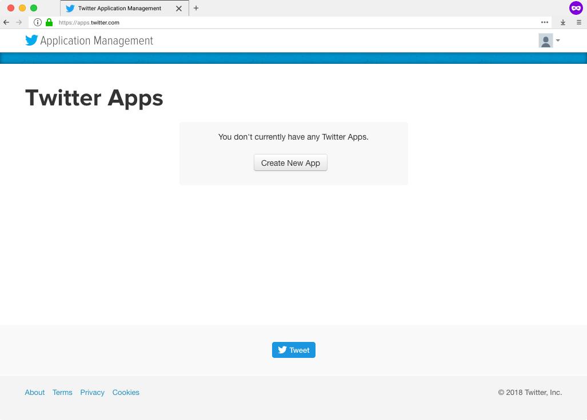

```{r setup, include=FALSE}
knitr::opts_chunk$set(echo = TRUE, eval = FALSE, collapse = TRUE, comment = ">")
options(htmltools.dir.version = FALSE)
htmltools::tagList(rmarkdown::html_dependency_font_awesome())
library(tidyverse)
library(rtweet)
head <- function(x, n = 6) {
  x[sapply(x, is.numeric)] <- lapply(x[sapply(x, is.numeric)], round, 2)
  x <- utils::head(x, n)
  knitr::kable(x, format = "html")
}
```

class: center, middle

Presentation created using **{xaringan}** (the **robot** theme)

Slides available at [mkearney.github.io/dsa_execweek_talk/index.html](https://mkearney.github.io/dsa_execweek_talk/index.html)

---

background-size: 150px auto
background-position: 490px 185px, 567px 320px, 644px 185px, 721px 320px, 644px 455px, 567px 50px
background-image: url(img/chr-logo.png), url(img/hexagon-logo.png), url(img/textfeatures-logo.png), url(img/tfse-logo.png), url(img/botrnot-logo.png), url(img/rtweet-logo.svg)

# About Me

**Background**

- PhD in COMS from Kansas

**Research interests**

- Partisan selective exposure
- Digital and social media

**\#rstats packages**

- Twitter APIs: [**{rtweet}**](https://cran.r-project.org/package=rtweet)
- Text analysis: [**{textfeatures}**](https://cran.r-project.org/package=textfeatures) [**{chr}**](https://github.com/mkearney/chr/)
- Data wrangling/viz: [**{hexagon}**](https://github.com/mkearney/hexagon/) [**{tfse}**](https://github.com/mkearney/tfse/)
- Machine learning: [**{botrnot}**](https://github.com/mkearney/botrnot/)

**Shiny apps**

- Web app interface for [botrnot](https://mikewk.shinyapps.io/botornot/)
- [Interactive friendship tool](https://mikewk.shinyapps.io/friendship/)

---

# Ouverview
+ Public concern about automated and manipulative "bot" accounts
   - "Fake news" and bots during the 2016 election
   - Bots create traffic/amplify social divisions

+ Detection of bots on Twitter
   - Can we classify bots in real time to help people identify artificial accounts/trends?
   - How do we build a train/test data set?

+ Future directions
   - This all begs the question, what is a "Twitter bot"?

---

# 2016 election

Concerns about **automated accounts, or bots, on social media** manipulating public opinion reached a fever pitch during the 2016 general election. 

The most alarming concerns were all related to behaviors of **Kremlin-linked bots** for:

+ pushing **fake news** stories

+ amplifying **social divisions**

+ intesifying **partisan** conflict

---

# Research questions

How do we **identify bots on social media**?

How can we do it in **real-time** so as to filter out inauthentic social media traffic?

---

# Social media data

**Reactions** to recent news about Cambridge Analytica

1. **Facebook was negligent** because it inadequately regulated third party apps

1. **Cambridge Analytica was unethical** because it stole and used data they shouldn't have

&nbsp;

In other words...people don't know exactly what FB and CA actually did, but they know it was wrong.

---


# Social media APIs

Social media platforms encourage and regulate third party applications via **APIs**
+ **Application Program Interfaces** (APIs) are sets of protocols that govern interactions between sites and users

Similar to web browsers but with different primary objective:
+ Web browsers **render content**
+ Web APIs **organize data**

For public APIs, many sites only allow access to **authorized** users
+ Twitter, Facebook, Instagram, Github, etc.


---

# Twitter vs. Facebook

For a case study about political bots on social media, Twitter is

1. More open about its **data**
   + Unlike Facebook, which actually clamped down on data sharing (with developers) starting in 2014, **Twitter is quite open with its data**

1. More **public facing**
   + **Default privacy setting** is public
   + User **connections** are asymmetrical

---

# Twitter APIs

To connect to Twitter's APIs, users need a **consumer key** and **consumer secret**, which you can get by creating a Twitter app.

View the built-in vignette **`auth`** for instructions on obtaining and storing user access tokens.<sup>\* </sup>

```{r}
## view rtweet's authorization vignette
vignette("auth", package = "rtweet")
```

Or look up the vignette online: [rtweet.info/articles/auth.html](http://rtweet.info/articles/auth.html)

.footnote[
<sup> \* </sup> For a while, rtweet users were not required to create their own Twitter applications. [That recently changed](https://github.com/mkearney/rtweet/issues/179#issuecomment-365689068), but hopefully it's resolved soon.
]

---
class: inverse, center, middle


# Obtaining and using Twitter API keys

---


# Create a Twitter App

<span>1.</span> Log in to your [Twitter.com](https://twitter.com) account

<span>2.</span> Go to [apps.twitter.com](https://apps.twitter.com/) and select **Create New App**

<span style="margin-left:15%"></span>

---

<span>3.</span> Complete the fields (**important**: Callback URL must be exact)
  - Name: `{{initials}}_twitter_app`
  - Description: `{{something about analyzing Twitter data}}`
  - Website: `https://twitter.com/{{you_screen_name}}`
  - **Callback URL:** `http://127.0.0.1:1410`

<span style="margin-left:15%"></span>

<span>4.</span> Store name of app as `app_name` in R script

```{r}
## name of twitter app
app_name <- "mwk_twitter_app"
```

---


# Copy API keys

<span>5.</span> Click **Create your Twitter application**

<span>6.</span> Select **Keys and Access Tokens** tab

<span>7.</span> Copy the **Consumer Key (API Key)** and **Consumer Secret (API Secret)** and paste into R script

<span style="margin-left:15%"></span>

```{r}
## copy and pasted *your* keys (these are fake)
consumer_key <- "XYznzPFOFZR2a39FwWKN1Jp41"
consumer_secret <- "CtkGEWmSevZqJuKl6HHrBxbCybxI1xGLqrD5ynPd9jG0SoHZbD"
```

---

# Create your token

<span>8.</span> Pass the stored values to `create_token()` to create the Twitter authorization token.

```{r}
## create token
token <- create_token(app_name, consumer_key, consumer_secret)

## print token
token
```


---

# Storing your token

Every request sent to Twitter must include a token. Save yourself trouble by storing it as an environment variable.

```{r}
## save token to home directory
path_to_token <- file.path(path.expand("~"), ".twitter_token.rds")
saveRDS(token, path_to_token)

## create env variable TWITTER_PAT (with path to saved token)
env_var <- paste0("TWITTER_PAT=", path_to_token)

## save as .Renviron file (or append if the file already exists)
cat(env_var, file = file.path(path.expand("~"), ".Renviron"),
  fill = TRUE, append = TRUE)
```

Normally `.Renviron` is processed on start-up, so refresh it.

```{r}
## refresh .Renviron variables
readRenviron("~/.Renviron")
```


---
class: inverse, center, middle

# Twitter data

---

# Getting the data

Functions in **{rtweet}** correspond with different [API] paths. For example, use `rtweet::get_timeline()` to return up to the most recent 3,2000 tweets posted by a given user.

```{r}
cnn <- get_timeline("cnn", n = 3200)
ts_plot(cnn, "hours")
```

<span style="margin-left:1%"></span>

---
class: inverse, center, middle

# Identifying bots

---

# Current approaches

The creators of [**botometer**]() maintain a list open sourced academic studies that identified bots.

But this approach is not without **limitations**:
+ Academic research moves slowly (especially with Twitter banning many of the bots)
+ Relatively small number have been collected
+ Labour intensive methods (human coding)

---

# New approach

One **solution** to these limitations is to combine the academic sources with an easy-to-automate method that takes advantage of naturally occcurring human coding

1. Select a handful of previously verified bots
1. Look up the public **lists** that include those bots
1. Identify lists **names** that self identify as bot lists

---
class: inverse, center, middle

# Compiling data sets

---

# User/tweet data

Using the list of screen names for non-bot (based on previous academic research and human coding) and bot accounts, I gathered...

+ **tweet-level data** for the most recent 100 tweets posted by each user `rtweet::get_timelines()`

+ **user-level (or account-level) data** for each user `rtweet::lookup_users()`

The data returned by Twitter consists of over 60 features related to the tweet and author (user) of each tweet.

---

# Data sets

Randomly sample Twitter data into train and test data sets

+ **Train data**: approx. 70% of users in sample
   - Making sure there are a roughly equal number of bots and non-bots

+ **Test data**: remaining (30%) bot and non-bot accounts

---

# Features

In addition to the numeric variables already returned by Twitter, I created the **{textfeatures}** package, which extracts 26 features from a supplied character vector.

The text features were extracted for:

+ Tweets
+ Name
+ Screen name
+ Location
+ Description (bio)

---
class: inverse, center, middle

# Modeling

---

# Two models

Two models were created. 

1. The **default model**, which uses both users and tweets data.

1. The **fast model**, which uses only users data

---

# Model results

A gradient boosted logistic model **{gbm::gbm()}** was trained and tested on the two data sets for both the default and fast models.

+ The **default model** was 93.53% accurate when classifying bots and 95.32% accurate when classifying non-bots

+ The **fast model** was 91.78% accurate when classifying bots and 92.61% accurate when classifying non-bots

Overall...

+ The **default model** was correct 93.8% of the time

+ The **fast model** was correct 91.9% of the time.

---

# Applications

+ This has since been assembled into an R package [**{botrnot}**](https://github.com/mkearney/botrnot)---coming soon to CRAN!

+ It has also been exported as a [Shiny web app](https://mikewk.shinyapps.io/botornot)

---
c
# Future research

Between the proliferation of news stories about Kremlin-linked bots on social media and the number of false positives reported to me about **botrnot**, I'm starting to think...

The real challenge is not **identifying** social media bots but instead **defining** what is means to be a *bot* on social media

+ Future research should examine how and why people define certain accounts as bots and others as not bots

---
lass: inverse, center, middle

# The end

